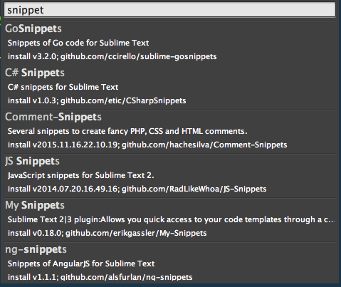

##Miscellaneous protips

###Snippets
Snippets let you autocomplete large blocks of text by typing a word, then typing the tab. 

#####Some Examples
- In any file
  - *lorem*, `tab` : creates a paragraph of lorem ipsum text
- In `.html` file
  - *html*, `tab` : creates the standard html5 skeleton (`<doctype>`, `<html>`, `<body>`, `<title>` )
- In `.js` file
  - *fun*, `tab` : creates a function that you can then tab through to fill out the relevant portions (function-name, function-parameters, function-body)

####Get some snippets
Go to the command palette (`⇧` + `⌘` + `P`) and search for snippets through Package Control.

Example: 




####Create your own snippet

Sublime has some useful snippets out of the box, and you can also create your own. Snippets use XML syntax.

Here is a custom one for a for-each loop in javascript

```
<snippet>

  <content><![CDATA[
${1:myArr}.forEach(function(${2:args}){
  //${3:body}
})]]>
  </content>

  <tabTrigger>foreach</tabTrigger>
  <scope>source.js</scope>

</snippet>

```

**Format**
- encapsulating `<snippet>` tag
- `<content>` tag must contain the snippet-text
  - inside the snippet text you insert the text
  - ${«numbr»:«var_name»} will create a default block of text that you can tab through and overwrite
- `<tabTrigger>` contains the the name of the snippet, this is how you will  activate it in your code
- `<scope>` is the file-type where it is used

**Saving**
- save the file as `«snippet-name».sublime-snippet`

**Access**  


